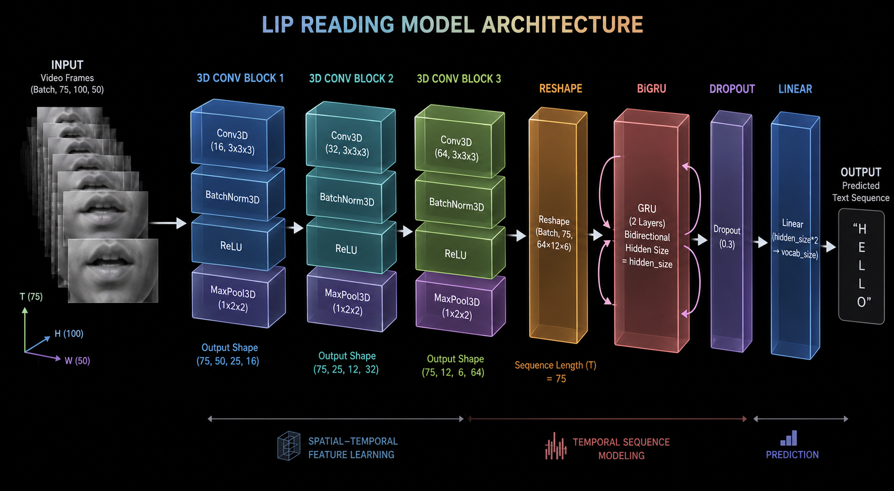

# Lip-Reading 

An end-to-end deep learning project that translates video sequences of a person's mouth into spoken text. This repository contains the complete pipeline,from data preprocessing and lip region extraction to model training and a deployable inference API.

## Core Idea
The goal of this project is to perform sentence-level lip reading. Given a video of a person speaking, the system uses MediaPipe to track and extract the Region of Interest (ROI) around the lips. These grayscale video frames are then passed into a spatio-temporal neural network that predicts the sequence of spoken characters without needing frame-by-frame alignment.

## Model Architecture

The model is designed to capture both the spatial features of the lips and the temporal dynamics of speech:
1. **3D Convolutional Neural Networks (3D CNNs):** Three layers of 3D convolutions (with Batch Normalization and Max Pooling) extract spatial features and short-term temporal patterns from the sequence of video frames.
2. **Bidirectional GRU (BiGRU):** A 2-layer BiGRU processes the sequence of extracted features to understand the broader temporal context of the spoken sentence.
3. **CTC Loss / Decoding:** A fully connected linear layer maps the GRU outputs to character probabilities. Connectionist Temporal Classification (CTC) loss is used during training to align the unsegmented video frames with the text labels.

## Dataset & Preprocessing
The model is trained on the **GRID Corpus**. 
During the EDA and extraction phase (available in the Jupyter notebooks), the MediaPipe Face Landmarker is used to precisely isolate the lip boundaries. The extracted ROIs are converted to grayscale and resized to 100x50 pixels before being fed into the network.

## Training & Model Weights
* **Compute:** The training pipeline (`train.py`) was containerized and executed on cloud GPUs (T4) using [Modal.com](https://modal.com). 
* **Performance:** Due to compute resource limits, training was early-stopped at a CTC loss of approximately **0.5**. 
* **Model Hosting:** The pre-trained weights are hosted on Hugging Face. You can find the model repository here: [`bekalemu/Lip-Reading`](https://huggingface.co/bekalemu/Lip-Reading).

## Inference API
The `/api` directory contains a production-ready REST API built with **FastAPI**. 
* On startup, the API automatically downloads the latest model weights from Hugging Face.
* It exposes a `/predict` endpoint where you can submit a processed `.mp4` lip sequence and receive the decoded text prediction alongside the ground truth label.
* You can test the inference script locally using `api/inference.py`.

## Credits & Acknowledgements
This project is heavily inspired by the pioneering work of **LipNet** (*LipNet: End-to-End Sentence-level Lipreading* by Yannis M. Assael, Brendan Shillingford, Shimon Whiteson, and Nando de Freitas). Full credit to the authors for the foundational architecture of utilizing spatio-temporal convolutions paired with CTC for sentence-level lip reading.
